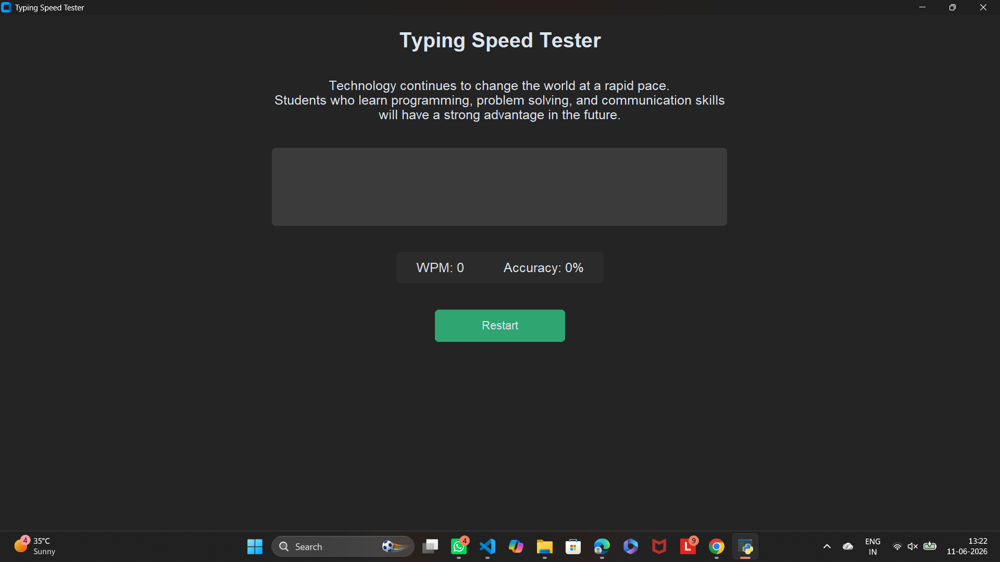
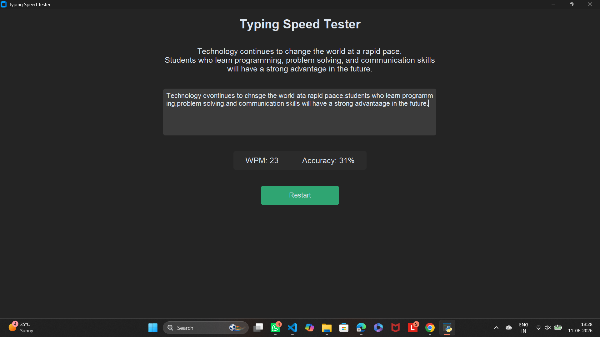

# ⌨️ Typing Speed Tester


A clean and modern **Typing Speed Tester** built with **Python** and **CustomTkinter**.  
The application measures your **Words Per Minute (WPM)** and **Typing Accuracy** in real time while practicing with randomly selected sentences.

---

## ✨ Features

- 🚀 Real-time WPM calculation
- 🎯 Live accuracy tracking
- 🔄 Restart test anytime
- 📝 Random practice sentences
- 🌙 Modern dark-themed UI
- 🖥️ Built using CustomTkinter

---

## 📸 Screenshots

### Main Menu


### Speed Test Window


---

## 📂 Project Structure

```text
.
├── main.py
├── ui.py
├── logic.py
├── sentences.py
├── screenshots/
│   ├── menu.png
│   └── speed_test.png
└── README.md
```

---

## ⚙️ Installation

```bash
git clone <repository-url>
cd typing-speed-tester
pip install customtkinter
```

---

## ▶️ Run

```bash
python main.py
```

---

## 🛠️ Tech Stack

- Python
- CustomTkinter
- Tkinter

---

## 👨‍💻 Author

**Yash Kumar Singh**

---

⭐ If you like this project, consider giving it a star.
