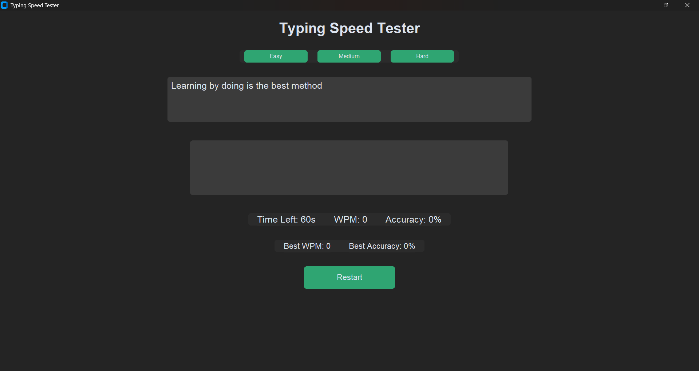

# ⌨️ Typing Speed Tester — Desktop Edition (V2.4)


> A modern, dark-themed desktop typing test built with Python and CustomTkinter — real-time WPM and accuracy tracking, live character highlighting, difficulty modes, persistent high scores, and sound feedback.

---

## 📸 Preview

<p align="center">
  
</p>

---

## ✨ Features

| Feature | Description |
|---|---|
| 🚀 **Real-Time WPM** | Words-per-minute calculated live as you type |
| 🎯 **Live Accuracy** | Character-by-character accuracy tracking |
| ⏱️ **60s Countdown Timer** | Starts automatically on first keystroke |
| 🟢 **Correct Char Highlighting** | Green for correct, red for wrong — instant visual feedback |
| 📚 **Difficulty Modes** | Easy / Medium / Hard sentence pools |
| 🏆 **Persistent High Scores** | Best WPM & accuracy saved across sessions |
| 🔊 **Sound Feedback** | Keystroke, error, and finish sounds |
| 🔄 **Restart Anytime** | Fully resets timer, stats, and sentence |
| 🌙 **Dark UI** | Built entirely with CustomTkinter |

---

## 🗂️ Project Structure

```
desktop-version/
│
├── main.py                # 🚀 Entry point — launches the app
├── ui.py                  # 🖥️  CTk GUI — difficulty buttons, dual text boxes, live highlighting, timer loop
├── logic.py                # 🧠 WPM calculation, accuracy calculation, timer
├── sentences.py            # 📝 Easy / Medium / Hard sentence pools
├── highscore.json          # 💾 Persisted best WPM & accuracy
├── requirements.txt        # 📦 Dependencies
│
├── sounds/
│   ├── key.wav              # ⌨️  Plays on every keystroke
│   ├── error.wav            # ❌ Plays once per wrong character
│   └── finish.wav           # 🎉 Plays when the timer ends
│
└── screenshots/
    ├── menu.png
    ├── speed_test.png
    ├── V2.3.png
    └── V2.4.png
```

---

## 🛠️ Tech Stack

| Layer | Technology | Purpose |
|---|---|---|
| **Language** | Python 3.10+ | Core application logic |
| **GUI** | [CustomTkinter](https://github.com/TomSchimansky/CustomTkinter) | Modern dark-themed desktop interface |
| **Audio** | Playsound 1.2.2 | Keystroke, error, and finish sound effects |
| **Storage** | JSON | Persistent high-score tracking |
| **Timing** | `time` (standard lib) | Elapsed-time tracking for WPM |

---

## 🖥️ UI Architecture — `ui.py`

The `TypingSpeedApp` class builds the entire interface in one window (`1100x850`):

```
┌─────────────────────────────────────────────┐
│              Typing Speed Tester             │  ← Title
├─────────────────────────────────────────────┤
│      [Easy]   [Medium]   [Hard]               │  ← Difficulty buttons
├─────────────────────────────────────────────┤
│  Sentence Display (read-only, highlighted)    │  ← Target sentence
│  🟢 correct chars   🔴 wrong chars             │
├─────────────────────────────────────────────┤
│  Input Textbox (typing happens here)          │  ← Live input
├─────────────────────────────────────────────┤
│  Time Left: 60s   WPM: 0   Accuracy: 0%       │  ← Live stats
│  Best WPM: 0      Best Accuracy: 0%           │  ← Persisted high scores
├─────────────────────────────────────────────┤
│                 [ Restart ]                   │
└─────────────────────────────────────────────┘
```

### Key Mechanics

- **`check_typing()`** fires on every `<KeyRelease>` — plays a key sound, checks the *last typed character* against the target sentence (playing an error sound only on a fresh mistake), re-highlights the full sentence, and recalculates WPM/accuracy live.
- **Highlighting** uses two `CTkTextbox` tags — `"correct"` (green) and `"wrong"` (red) — re-applied character-by-character on every keystroke via `highlight_text()`.
- **Timer** starts lazily — only on the *first* keystroke via `start_timer()` — then ticks down every second using `root.after(1000, ...)`. At zero, the input box is disabled and the finish sound plays.
- **High scores** are checked and saved on *every keystroke*, not just at test end — `best_wpm` / `best_accuracy` update live and persist to `highscore.json` immediately.
- **Sounds** run on background daemon threads (`threading.Thread`) so `playsound` never blocks the GUI's main loop.

---

## 🧠 Core Logic — `logic.py`

### WPM Calculation
```python
words = len(typed_text) / 5          # standard: 5 chars = 1 "word"
minutes = elapsed_time / 60
wpm = round(words / minutes)
```

### Accuracy Calculation
```python
# Compares typed text against the original character-by-character
correct_chars = sum(1 for i in range(min(len(original), len(typed)))
                     if original[i] == typed[i])
accuracy = round((correct_chars / len(typed)) * 100)
```

---

## 🆕 Version History

| Version | Highlights |
|---|---|
| **V2.0** | ⏱️ 60-second countdown timer — auto-starts on first keystroke, disables input at zero |
| **V2.1** | 🟢🔴 Live character highlighting — correct chars turn green, wrong turn red |
| **V2.2** | 📚 Difficulty modes — Easy (short), Medium (balanced), Hard (long & complex) |
| **V2.3** | 🏆 High score system — best WPM & accuracy persisted in `highscore.json`, auto-loads on startup |
| **V2.4** | 🔊 Sound effects — keystroke sound, single error sound per mistake, finish sound; improved sentence scaling (Easy 3 lines / Medium 6 lines / Hard 8–9 lines) |

---

## 📚 Sentence Pools — `sentences.py`

| Difficulty | Style | Length |
|---|---|---|
| 🟢 **Easy** | Short, simple, everyday phrases | 3 lines |
| 🟡 **Medium** | Balanced complexity, programming/productivity themes | 6 lines |
| 🔴 **Hard** | Long, technical, multi-clause sentences | 8–9 lines |

Each pool contains 5 hand-written sentence sets, randomly selected per test.

---

## ⚙️ Setup & Installation

### Prerequisites
- Python 3.10+
- pip

### Install Dependencies

```bash
pip install -r requirements.txt
```

This installs:
```
customtkinter
playsound==1.2.2
```

### Run

```bash
python main.py
```

---

## 🔮 Planned Features

- [ ] 📊 WPM-over-time graph after each test
- [ ] 🌐 Multiplayer / leaderboard mode
- [ ] 🎨 Theme switcher (light/dark/custom accent)
- [ ] ⌨️ Custom sentence import

---

## 👨‍💻 Author

**Yash Kumar Singh**

Built with ❤️ — Desktop Edition (Python / CustomTkinter), part of the dual-version Typing Speed Tester project.

---

⭐ If you like this project, consider giving it a star.