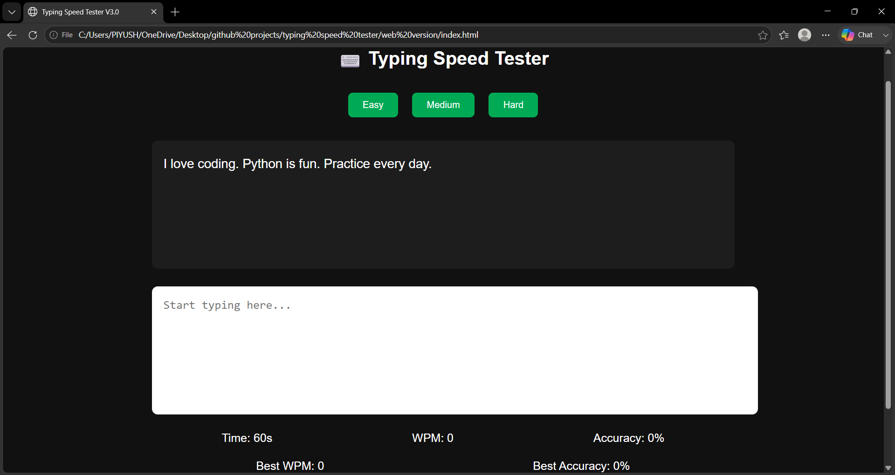

# ⌨️ Typing Speed Tester — Web Edition (V3.0)


> A browser-based typing test — zero dependencies, pure vanilla JS. Real-time WPM and accuracy, per-character live highlighting, difficulty modes, and persistent high scores via `localStorage`.

---

## 📸 Preview

<p align="center">
  
</p>

---

## ✨ Features

| Feature | Description |
|---|---|
| 🚀 **Real-Time WPM** | Calculated on every keystroke based on elapsed time |
| 🎯 **Live Accuracy** | Character-by-character comparison against the target sentence |
| ⏱️ **60s Countdown Timer** | Starts on the first keystroke via `setInterval` |
| 🟢 **Per-Character Highlighting** | Each character is its own `<span>` — turns green (correct) or red (wrong) live |
| 📚 **Difficulty Modes** | Easy / Medium / Hard sentence pools |
| 🏆 **Persistent High Scores** | Best WPM & accuracy saved in browser `localStorage` |
| 🔊 **Sound Feedback** | Keystroke, error, and finish sounds via the HTML5 `Audio` API |
| 🔄 **Instant Restart** | Resets timer, input, and loads a new sentence |
| 🌙 **Dark UI** | Minimal dark theme, green accent, no frameworks |
| ⚡ **Zero Dependencies** | Pure HTML/CSS/JS — no build step, just open in a browser |

---

## 🗂️ Project Structure

```
web-version/
│
├── index.html        # 🏗️  Page structure — sentence box, input, stats, buttons
├── style.css          # 🎨 Dark theme, green accent, correct/wrong span colors
├── script.js          # ⚙️  Typing engine — timer, WPM/accuracy, highlighting, high scores
├── sentences.js        # 📝 Easy / Medium / Hard sentence arrays
│
└── sounds/
    ├── key.wav          # ⌨️  Plays on every keystroke
    ├── error.wav        # ❌ Plays on a wrong character
    └── finish.wav       # 🎉 Plays when the timer hits 0
```

---

## 🛠️ Tech Stack

| Layer | Technology | Purpose |
|---|---|---|
| **Structure** | HTML5 | Semantic layout — sentence box, input, stats panels |
| **Styling** | CSS3 | Dark theme, flexbox stat rows, correct/wrong span coloring |
| **Logic** | Vanilla JavaScript (ES6+) | Timer, WPM/accuracy calculation, DOM-based highlighting |
| **Audio** | HTML5 `Audio` API | Keystroke, error, and finish sound effects |
| **Persistence** | Web `localStorage` API | Best WPM & accuracy survive page reloads |

---

## ⚙️ Typing Engine — `script.js`

### Per-Character Highlighting

Unlike the desktop version's text-tag approach, the web version wraps **every character of the sentence in its own `<span>`** on load:

```javascript
sentenceBox.innerHTML =
    currentSentence.split("").map(char => `<span>${char}</span>`).join("");
```

On each keystroke, every span's class is updated individually:

```javascript
spans.forEach((span, index) => {
    const char = typed[index];
    if (char == null) span.className = "";
    else if (char === span.innerText) span.className = "correct";
    else {
        span.className = "wrong";
        errorSound.play();
    }
});
```

### WPM Calculation
```javascript
const minutes = (60 - timer) / 60;   // elapsed time, derived from the countdown
const wpm = Math.round((text.length / 5) / minutes);
```

### Accuracy Calculation
```javascript
// Counts matching characters at each index, typed vs. target
const accuracy = Math.round((correctChars / text.length) * 100);
```

### High Score Persistence
```javascript
localStorage.setItem("bestWPM", wpm);
localStorage.setItem("bestAccuracy", accuracy);
```
Scores are checked and saved automatically when the timer hits zero, via `saveHighScore()`.

---

## 📚 Sentence Pools — `sentences.js`

| Difficulty | Style | Example Theme |
|---|---|---|
| 🟢 **Easy** | Short, simple, everyday phrases | "I love coding. Python is fun." |
| 🟡 **Medium** | Balanced, productivity/programming themes | "Typing speed improves with practice and consistency." |
| 🔴 **Hard** | Long, technical, multi-clause sentences | "Artificial intelligence is transforming the world rapidly..." |

A random sentence is picked from the active difficulty array on every load/restart.

---

## ⚙️ Setup & Run

No installation, no build tools, no server required.

```bash
git clone https://github.com/caffineblud/typing-speed-tester.git
cd typing-speed-tester/web-version
```

Then simply open `index.html` in your browser — or use a live server extension for auto-reload during development.

---

## 🔁 Web vs Desktop — Key Differences

| Aspect | Desktop (V2.x) | Web (V3.x) |
|---|---|---|
| **Language** | Python | JavaScript |
| **UI Framework** | CustomTkinter | None — raw HTML/CSS |
| **Highlighting Method** | `CTkTextbox` text tags | One `<span>` per character |
| **High Score Storage** | `highscore.json` (file) | `localStorage` (browser) |
| **Audio** | `playsound` on daemon threads | HTML5 `Audio` API |
| **Run Requirement** | Python + pip install | Just a browser |

---

## 🔮 Planned Features

- [ ] 📱 Mobile-responsive layout
- [ ] 🌐 Deploy as a live site (GitHub Pages / Vercel)
- [ ] 📊 WPM history chart
- [ ] 🎨 Theme switcher
- [ ] ⌨️ Custom sentence input

---

## 👨‍💻 Author

**Yash Kumar Singh**

Built with ❤️ — Web Edition (vanilla HTML/CSS/JS), part of the dual-version Typing Speed Tester project.

---

⭐ If you like this project, consider giving it a star.